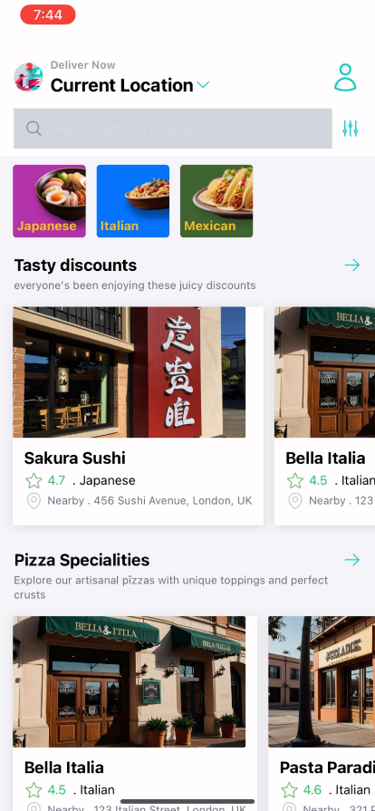
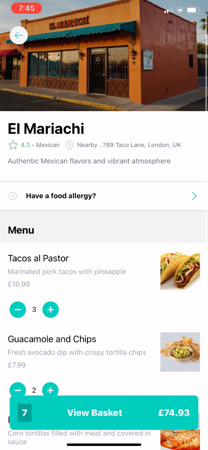
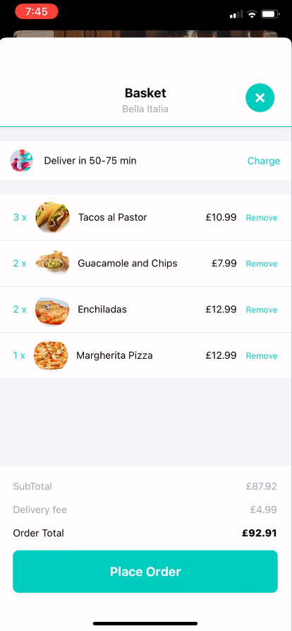
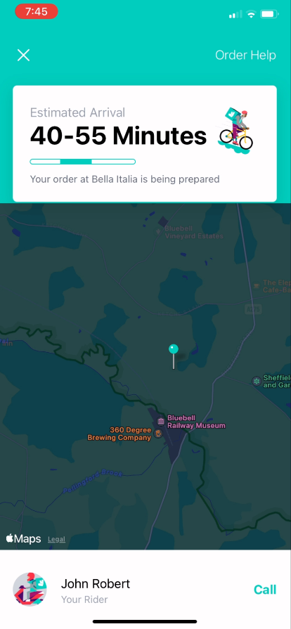

# Deliveroo Clone

This Deliveroo Clone app is built using React Native, offering a seamless and interactive experience for users to explore restaurants, select dishes, and place orders. The app efficiently handles state management with Redux, fetches data from a Sanity server, and uses Tailwind CSS for styling. It also includes caching for restaurant pages to ensure fast and smooth navigation.

## Features

- **Restaurant Browsing:** Explore a wide range of restaurants and cuisines.
- **Dish Selection:** Choose from various dishes and customize your order.
- **Basket Management:** Add, remove, and modify items in your basket before placing an order.
- **Order Placement:** Seamlessly place orders with a user-friendly interface.
- **State Management:** Efficiently handled using Redux for optimal performance.
- **Data Fetching:** Integrated with a Sanity server for dynamic data retrieval.
- **Caching:** Restaurant pages are cached to enhance the user experience by reducing load times.
- **Responsive Design:** Tailwind CSS ensures a clean and responsive design across devices.

## Screenshots

| Feature            | Screenshot                              |
|--------------------|-----------------------------------------|
| **Home Screen**    |  |
| **Restaurant** |  |
| **Basket Management** |  |
| **Order Delivery**  |  |

## Installation

1. Clone the repository:
   ```
   git clone https://github.com/hamdoudhakem/Deliveroo-Clone.git
   ```
2. Navigate to the project directory:
   ```
   cd Deliveroo-Clone
   ```
3. Install the dependencies:
   ```
   npm install
   ```
4. Run the app:
   ```
   npm start
   ```

## Technologies Used
- React Native
- Redux for state management
- Sanity.io for backend and content management
- Tailwind CSS for styling
- Expo for easy development and deployment

## Contributing
Contributions are welcome! Please feel free to submit a Pull Request.

## License
This project is licensed under the MIT License.

## Acknowledgments
- Deliveroo for inspiration
